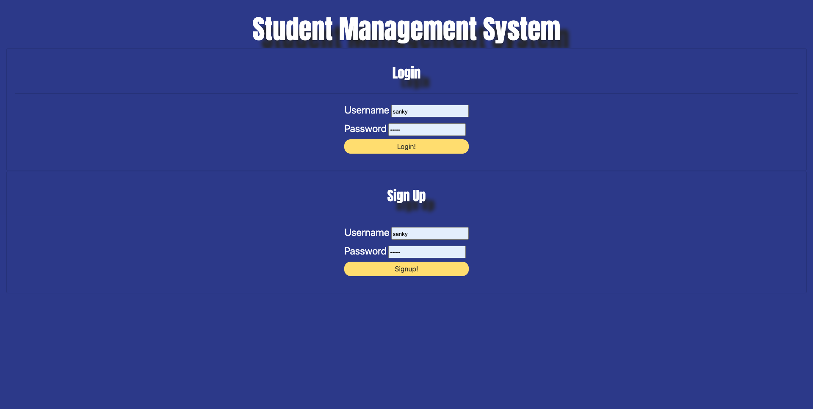
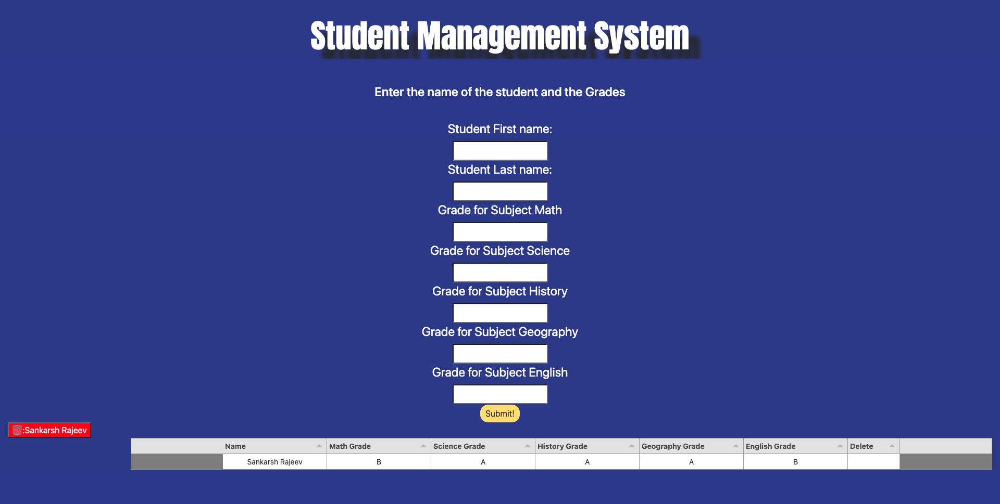

# student-database-management

## Description

Student Database management Syatem is an app that monitors the student grades per class in the backend and processes it on the front end. I have used SQL,HAndleBars Tabulator and PDF maker libraries in my project. Once you login you would be able to login as per credentials and submit data in the system.

## Installation

The webapp is deployed on Heroku and can be accessed via the following link.

https://peaceful-temple-56068.herokuapp.com/

## Usage

The first page displayed to the user is the login where runs from all users can either signup or login. To access a personal profile, the user must click "Login" on the top of the screen. From there, the user will be prompted to enter the data of the students. Once the form is filled out, the data will be logged into the table using Tabulator.js .  Once that is filled in, and the user hits submit, the table will change to reflect the student data. 

md
md

## Credits
This project was created by Sankarsh Rajeev. 
TA Meg Meyers helped me with this project.